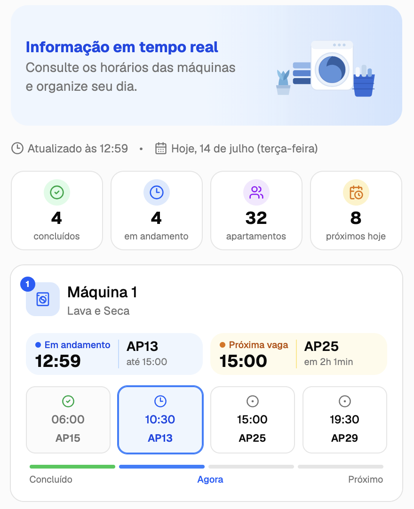
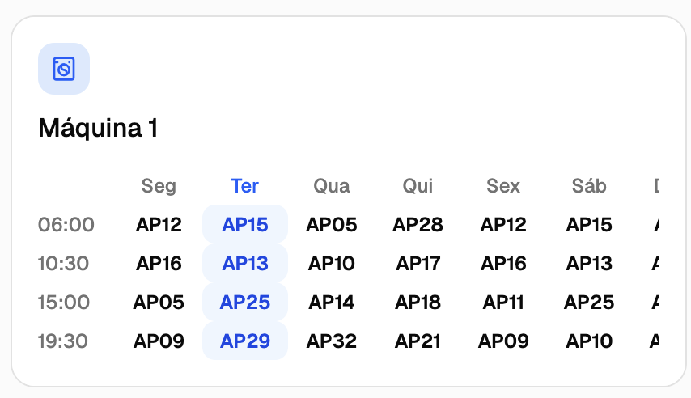

# Lavanderia — Residencial Campeche

Página estática (React + TypeScript + Vite) com os horários da lavanderia comunitária, feita para substituir a planilha Excel por algo visual, fácil de checar pelo celular e simples de compartilhar no WhatsApp do condomínio.

Static site (React + TypeScript + Vite) showing the community laundry room schedule — built to replace a confusing Excel spreadsheet with something visual, mobile-friendly, and easy to share on the condo's WhatsApp group.

<p align="center">
  
  
</p>

---

## 🇧🇷 Português

### O que o app faz

- **Máquinas** — mostra, em tempo real (horário de São Paulo), qual apartamento está usando cada uma das 4 máquinas agora, e qual é o próximo da fila, com contagem regressiva.
- **Calendário** — rodízio semanal completo (segunda a domingo) de cada máquina, com o dia de hoje destacado.
- **Informações** — horário de funcionamento (com aviso automático quando o horário está prestes a mudar), lembrete para trazer sabão/amaciante próprio, regras da lavanderia e um botão para falar com a administração direto pelo WhatsApp.

Tudo é somente leitura — não há login, cadastro nem reservas. É só um mural digital do rodízio que já existe.

### Rodar localmente

```bash
npm install
npm run dev
```

### Atualizar horários, rodízio ou regras

Toda a lógica de negócio fica em `src/schedule.ts` — nenhum outro arquivo precisa mudar:

- `scheduleRules`: lista ordenada de horários de funcionamento, cada um com data de início/fim. Para anunciar uma mudança futura, adicione uma nova entrada com `validFrom`.
- `machines`: o rodízio semanal de cada máquina — qual apartamento usa qual horário, em cada dia da semana.
- `dailySlots`: os 4 horários fixos do dia (06:00, 10:30, 15:00, 19:30).
- `weeklyLimitPerUnit`: limite de usos por semana por unidade.

---

## 🇺🇸 English

### What it does

- **Machines** — shows, live (São Paulo time), which apartment is currently using each of the 4 machines, and who's up next, with a countdown.
- **Calendar** — the full weekly rotation (Monday–Sunday) for every machine, with today's column highlighted.
- **Info** — opening hours (with an automatic heads-up when the hours are about to change), a reminder to bring your own soap/softener, the laundry room rules, and a button to message the building administration directly on WhatsApp.

Everything is read-only — no login, no sign-up, no booking. It's just a digital version of the rotation that already exists.

### Run locally

```bash
npm install
npm run dev
```

### Updating hours, the rotation, or the rules

All business logic lives in `src/schedule.ts` — no other file needs to change:

- `scheduleRules`: ordered list of opening-hour rules, each with a start/end date. To announce a future change, add a new entry with `validFrom`.
- `machines`: each machine's weekly rotation — which apartment gets which time slot, on which day.
- `dailySlots`: the 4 fixed daily time slots (06:00, 10:30, 15:00, 19:30).
- `weeklyLimitPerUnit`: weekly usage limit per unit.

---

## Autor / Author

Feito por / Built by [Felipe Rodrigues](https://github.com/felipprodrigues).
